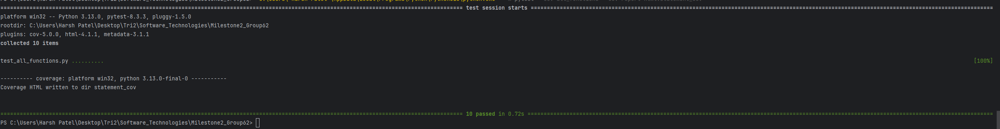
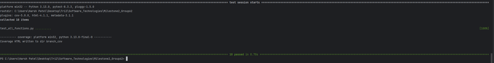

# Coverage Testing Report

### GitHub Repository URL: https://github.com/kisangkay/Milestone2_Group62.git

---

## 1. **Test Summary**
list all tested functions related to the five required features, for example:

| **Tested Functions**                                                 |
|----------------------------------------------------------------------|
| `on_search(event)`                                                   | 
| `get_on_food_selected(event)`                                        |
| `get_on_filter(food_data, nutrient, min_density, max_density)`       |
| `get_filter_nutrition_level(food_data, selected_nutrient, level)`    |
| `get_comparison_click(food_data, selected_nutrient, selected_foods)` |

---

## 2. **Statement Coverage Test**

### 2.1 Description

For all functions in the assignment, we designed tests to achieve 100% statement coverage by covering both valid and invalid input scenarios. This approach ensured that every possible code path was tested, including expected behaviors and error handling. By validating both successful cases and edge cases, we made sure that each line of code was executed, leading to a robust and reliable codebase.

### 2.2 Testing Results

## 3. **Branch Coverage Test**

### 3.1 Description

For all functions in the assignment, we designed tests to achieve 100% branch coverage by covering both valid and invalid input scenarios. This approach ensured that every decision point in the code was tested, including all possible outcomes of conditional statements. By thoroughly validating both successful cases and error cases, we made sure that each branch was executed, leading to a comprehensive and reliable codebase.

### 3.2 Testing Results

