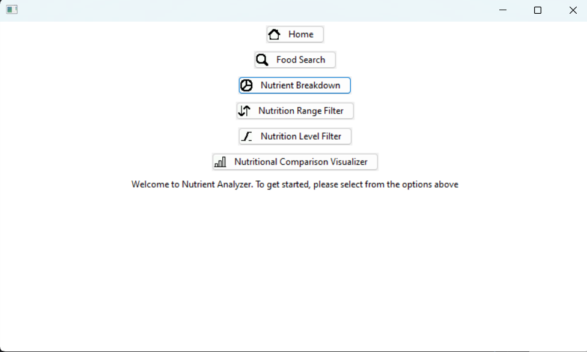
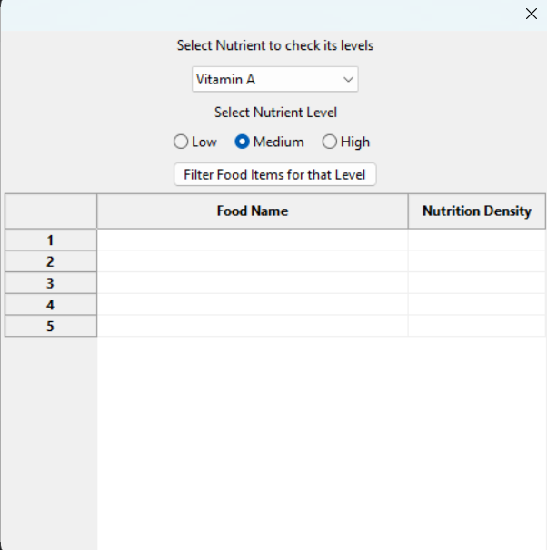

# Executive Summary

### GitHub Repository URL: https://github.com/kisangkay/Milestone2_Group62.git

---

# 1. Food  Search

## Description

The Food Search feature helps the users to quickly and easily obtain nutritional data on certain food products from  the  Nutritional  Food  Database.  When  users  enter  the  name  or  kind  of  food  they're  looking  for,  the  system will provide pertinent results, showing important nutritional information and letting them refine their search further depending on dietary levels.

## Steps

### **1. Use the Food Search Function:**

**i.** Navigate to the application's main menu.

**ii.** Click on the "Food Search" option to launch the search screen.

### **2. Enter in the food item:**

Enter the name or category of the food you want to look for (for example, "cheese," "chicken," or "salad") in the search field.

### **3. Start the Search:**

To run the search query, click the "Search" button.

### **4. View the results of your search:**

Relevant data for every food item will be shown in a list or grid style as a consequence of the results, including:

**i.** Name of Food

**ii.** Nutrition Names

**iii.** Nutrition Density

**iv.** Protein, Fat, and Carbohydrate and more Nutritional Values

### **5. Exit the Feature:**
After finishing searching, click the Close button to exit the Food Search interface.

### Screenshots
**1. Navigate the Food Search Function:** 

**2. Enter in the food Name:** 

**3. Start the Search:**

**4. View the results of the search:**

**5. Exit the Feature:**

---

# 2. Nutrition Breakdown

## Description

Users may choose a food item from the database and explore comprehensive graphical representations of its nutritional value by using the Nutrition Breakdown function. To see the ratios of different nutrients, including carbs, proteins, fats, vitamins, and minerals, this tool offers both pie charts and bar graphs.

## Steps

### **1. Select nutrient Breakdown Option:**

Go to the main menu or select the Nutrition Breakdown function.

### **2. Choose a Food item:**

**i.** All the Food Names shown in the list view.

**ii.** To view the food item's complete nutritional information, click on it.

### **3. View the breakdown of nutrients:**

**i.** The selection of a food shows the nutritional breakdown in Pie Chart.

**ii.** The quantities of macronutrients like Caloric Value, Protein, Fats, and Saturated Fats are displayed in a pie chart.

### **4. Go back to select another food:**

Click another food from Food List to choose a different food item after examining the nutritional information.

### **5. Exit the Feature:**

Once finished, select Close to exit or go back to the main menu.

### Screenshots
 
**1. Select nutrient Breakdown Option:** 

**2. Choose a Food item:**

**3. View the breakdown of nutrients:**

**4. Go back to select another food:**

**5. Exit the Feature:**

---

# 3. Nutrition Range Filter

## Description

Users may browse and filter a list of items that fall within a specific nutrient range by using the Nutrition Range Filter tool. To see items that fit the specified criteria, users can enter the lowest and maximum values for a certain nutrient (such as calories, protein, or fat). Based on their chosen nutrient preferences, this function assists users in finding meals that meet their unique dietary requirements.

## Steps

### **1. Select the Nutrition Range Filter Function:**

Navigate the Nutrition Range Filter option from the main menu.

### **2.Click on Drop Down function:**
Users can expand a hidden nutrient list to choose a nutrient from the drop-down list.

### **3. Select the Nutrients:**

Click on any Nutrient from the drop-down option foe which the user wants to see the minimum and maximum value.
 
### **4. Set the range of Nutrient:**

**i.** There are input slots for the Minimum Range and Maximum Range in a dialogue box that appears.  

**ii.** In the Min Range text area, provide the intended minimum value.  

**iii.** In the text section labelled "Max Range," type the desired maximum value.

### **5. Click on Filter:**  

**i.** A grid-style list of foods that fit within the chosen nutritional range will be displayed after "Filter" button is clicked. 

**ii.** The grid will show: 

**a. Food Name:** Each food item's name.  
**b. Nutrient Value:** The actual value of the chosen nutrient for every food item is known as the nutrient value.
  
### **6. Refine the Filter**  

**i.** Return to the Min Range and Max Range fields to change the numbers and also change the nutrient.

**ii.** Re-click Filter to refresh the results.

### **6. Exit the Feature:**  
After locating the foods you want, click the Close button to close the range filter dialogue and go back to the application's main screen or other features.

### Screenshots

**1. Select the Nutrition Range Filter Function:**

**2.Click on Drop Down function:**

**3. Select the Nutrients:**

**4. Set the range of Nutrient:**

**5. Click on Filter:** 

**6. Refine the Filter**  

**6. Exit the Feature:** 

---

# 4. Nutrition Level Filter

## Description

Users may filter items by low, mid, and high nutritional content levels for different nutrients, including fat, protein, carbs, sugar, and nutritional density, using the Nutrition Level Filter function. The following standards are used to categorise the nutritional levels:

**Low:** The chosen nutrient's value is less than 33% of its maximum value.

**Mid:** From 33% to 66% of the maximum amount.

**High:** Exceeding 66% of the maximum amount.

This function lets users filter items according to their nutritional composition, which makes it easier for them to choose foods that fit their dietary needs.

## Steps

### **1. Navigate the Nutrition Level Feature:**

Launch the app, then use the main menu to find the Nutrition Level Filter option and click on it to open.

### **2. Choose Your Nutritional Levels:**

**i.** There will be radio button for each level—Low, Medium, and High—in the dialogue box that displays.

**ii.** To filter for certain nutritional values, check the corresponding boxes:

**i. Low**: Choose this choice to incorporate foods with a nutritional value of less than 33%.

**ii. Medium:** Choose this option to include items that range from 33% to 66% in terms of nutritional value.

**iii. High:** Choose this choice to incorporate meals with a nutritional value more than 66%.

### **3. Click on the Filter button:**

**i.** Click the Filter button once the required nutritional values have been chosen.

**ii.** Based on the levels that have been chosen, the system will filter foods and update the grid with the filtered results.

### **4. View Results Filtered and again adjust the level:**

**i.** The filtered items will be shown in a grid with their quantities values.
**ii.** The grid will have the following items:

**i. Food Name:** Each food item's name.

**ii. Levels of Nutrients:** The particular concentration of every nutrient in every food item.

### **5. Exit the Feature:**

After locating the items you want, select Close to close the nutrition level filter dialogue and go back to the main program.

### Screenshots
    
**1. Navigate the Nutrition Level Feature:**

**2. Choose Your Nutritional Levels:**

**3. Click on the Filter button:**

**4. View Results Filtered and again adjust the level:**

**5. Exit the Feature:**

---

# 5. Nutritional Density Visualizer

## Description

Through a visual representation, users may compare the nutritional density of different food products with the Nutritional Density Visualizer tool. Users are presented with a bar chart that compares important elements including fats, proteins, carbs, and sugars when they pick three food products. This tool helps users make educated decisions on their dietary choices by giving a straightforward and interactive method to explore the nutritional value of different meals.

## Steps

### **1. Navigate the Nutritional Density Visualizer.**

Open the visualiser by selecting it from the dialogue window or application menu.

### **2. Choose the Nutrient**

Users choose nutrient from the drop-down list that they want to do food comparison for that nutrient.

### **3. Choose the Food to compare**

Users choose three food items from the drop-down list by selecting the ones they want in the selection box.

### **4. Press the 'Visualize' button.**

To produce the comparison, choose the food products and then click the 'Visualize' option.

### **Re-define the findings**

The data can be re-define, by selecting the another food to do comparisons.

### **5. Exit the Feature:**

After visualize the items you want, select Close to close the nutrition level filter dialogue and go back to the main program.

### Screenshots

**1. Navigate the Nutritional Density Visualizer.**

**2. Choose the Nutrient**

**3. Choose the Food to compare**

**4. Press the 'Visualize' button.**

**Re-define the findings**

**5. Exit the Feature:**

---
