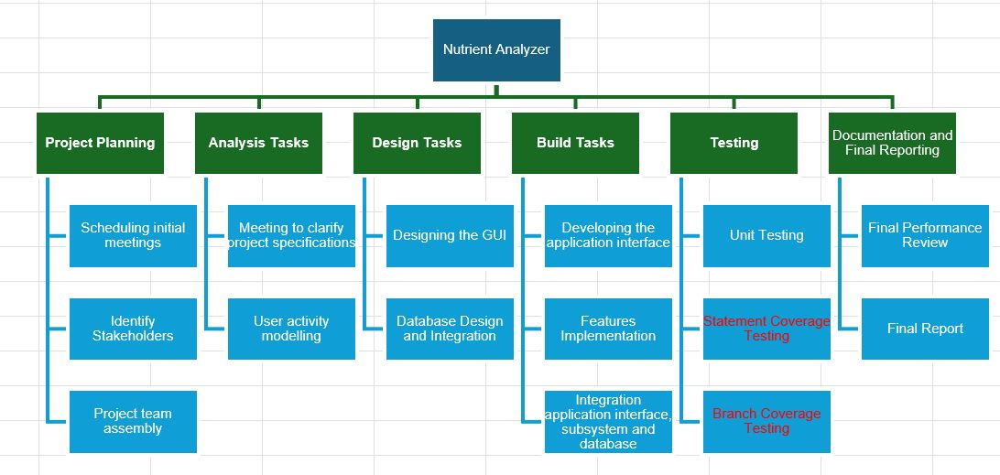
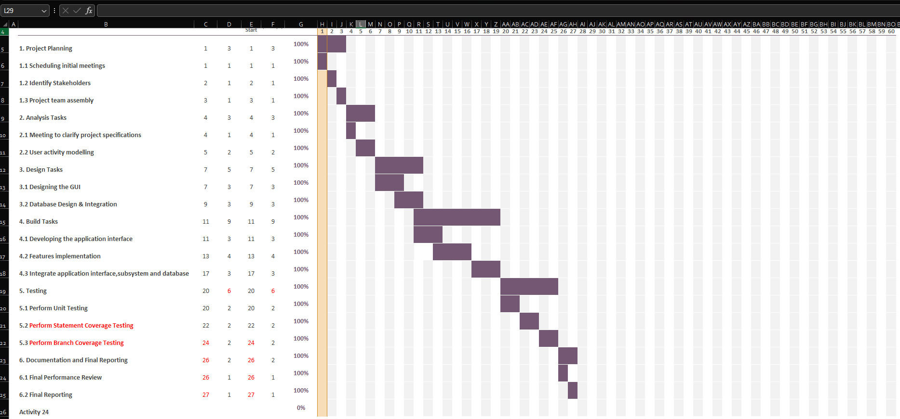

# Project Plan

## Project Name: Nutrient Analyzer
## Group Number: 062

### Team members

| Student No. | Full Name     | GitHub Username | Contribution (sum to 100%) | 
|-------------|---------------|-----------------|----------------------------|
| s5376549    | Harsh Patel   | harshpatel2361  | 33.3%                      |
| s5278432    | Simarjot Kaur | sim-21          | 33.3%                      | 
| s5330485    | Stephen Koech | kisangkay       | 33.3%                      | 

### Brief Description of Contribution 

Please Describe what you have accomplished in this group project.
- s5376549, Harsh Patel
  - Accomplishments: Integrated the database, developed the nutrition range filter, and led system testing.
  

- s5278432, Simarjot Kaur
  - Accomplishments: Designed the UI and implemented the nutrition visualization feature, focusing on usability testing.

- s5330485, Stephen Koech 
  - Accomplishments:  Participated in managing the project, designed the GUI and its components, implemented the features and functionalities in the .py files, and updated the Software Design Document

# Table of Contents

* [Project Plan](#project-plan)
  * [1. Project Overview](#1-project-overview)
    * [1.1 Project Objectives](#11-project-objectives)
    * [1.2 Project Stakeholders](#12-project-stakeholders)
    * [1.3 Project Scope](#13-project-scope)
  * [2. Work Breakdown Structure](#2-work-breakdown-structure)
  * [3. Activity Definition Estimation](#3-activity-definition-estimation)
  * [4. Gantt Chart](#4-gantt-chart)

## 1. Project Overview

The project involves developing a desktop application for data analysis and visualization using a nutritional food database. The goal is to create a tool that provides a graphical user interface (GUI) to handle and display various nutritional data from database. This tool will allow users to perform searches, filter data by nutritional content, and visualize the information through charts and graphs.

### 1.1 Project Objectives
The primary objectives of this project are:
* To design a user-friendly interface that enables efficient data interaction. 
* To implement key features such as food search, nutrition breakdown visualization, and filtering based on nutritional ranges.
* To ensure that the tool can process and display complex nutritional data accurately and quickly.

### 1.2 Project Stakeholders

Project Team:
* Stephen Koech: Lead developer, responsible for overall project management, coordinating with team members, and ensuring the successful implementation of the project.
* Simarjot Kaur and Stephen Koech: Responsible for designing the user interface and implementing core functionalities such as the search and filter features.
* Harsh patel and Stephen Koech: Focuses on data integration, handling the nutritional database, and ensuring accurate data visualization.

End-Users:
* Nutritionists and Dietitians: Professionals using the tool for meal planning, dietary advice, and health assessments.
* Health Researchers: Utilize the tool for analyzing nutritional data to support research studies.
* Educators: Teachers and professors incorporating the tool into their nutrition-related courses.

### 1.3 Project Scope

Development of a User Interface (UI):
The project includes designing and implementing a graphical user interface (GUI) that is user-friendly and intuitive. The UI will allow users to easily interact with the data, perform searches, apply filters, and visualize nutritional information.

Integration with Nutritional Food Database:
The application will integrate with the provided Nutritional_Food_Database.csv. This integration will enable users to search for foods by name, display detailed nutritional information, and perform analyses based on the nutritional content.

Key Functionalities:
* Food Search: Users will be able to search for food items by name and view all related nutritional information.
* Nutrition Breakdown Visualization: The tool will offer graphical representations (e.g., pie charts, bar graphs) of the nutritional content of selected food items.
* Nutrition Range Filter: Users can filter food items based on specified nutritional ranges, such as calories, fat content, protein levels, etc.
* Nutrition Level Filter: This feature will allow users to categorize foods into low, mid, and high nutritional levels based on defined thresholds.
*  Analysis of Nutrient Density Visualizer (Additional Feature): Users may examine how three nutrients vary in range of the selected nutrient, for example, how fats or how vitamins range in the selected foods differ. 

Subsystems: The project will be divided into several key subsystems
* User Interface (UI) Subsystem: Responsible for designing and implementing the graphical user interface.
* Search Subsystem: Handles the search functionality for food items in the nutritional database.
* Visualization Subsystem: Provides graphical representations of nutritional data.
* Filter Subsystem: Allows users to filter foods based on nutritional ranges and levels.

## 2. Work Breakdown Structure

## 3. Activity Definition Estimation

| Activity #No | Activity Name                                                     | Brief Description                                                                                                                        | Duration (in Days)                     | Responsible Team Members |
|--------------|-------------------------------------------------------------------|------------------------------------------------------------------------------------------------------------------------------------------|----------------------------------------|--------------------------|
| 1            | Project Planning                                                  | Initial planning, including scheduling and team assembly.                                                                                | Total 3                                | All                      |
| 1.1          | Scheduling initial meetings                                       | To clarify project specifications.                                                                                                       | 1                                      | All                      |
| 1.2          | Identify Stakeholders                                             | Determine key individuals or groups involved or impacted by the project.                                                                 | 1                                      | All                      |
| 1.3          | Project team assembly                                             | Assembling the project team and planning the project schedule.                                                                           | 1                                      | All                      |
| 2            | Analysis Tasks                                                    | Clarifying project specifications, defining system requirements, and modeling user activities.                                           | Total 3                                | All                      |
| 2.1          | Meeting to clarify project specifications                         | Clarifying project specifications with stakeholders.                                                                                     | 1                                      | All                      |
| 2.2          | User activity modelling                                           | Modeling user activities to define system requirements.                                                                                  | 2                                      | All                      |
| 3            | Design Tasks                                                      | Designing the graphical user interface (GUI), ensuring it is user-friendly and intuitive.                                                | Total 5                                | All                      |
| 3.1          | Designing the GUI                                                 | Designing the GUI and core functionalities (e.g., search, filter, visualization).                                                        | 3                                      | Stephen \& Simar         |
| 3.2          | Database Design & Integration                                     | Designing the database schema and integrating the Nutritional_Food_Database.csv with the application.                                    | 3                                      | Stephen \& Harsh         |
| 4            | Build Tasks                                                       | Develop a desktop software, implementing the functionalities (e.g., search, filter, visualization).                                      | Total 9                                | All                      |
| 4.1          | Developing the application interface                              | Develop the graphical user interface that will allow users to interact with the tool, including input fields, buttons, and layout.       | 3                                      | Stephen \& Simar         |
| 4.2          | Features implementation                                           | Implement the features Food Search, Nutrition Breakdown, Nutrition Level Filter, Nutrition Range Filter.                                 | 4                                      | All                      |
| 4.3          | Integrate application interface subsystem and database            | Link the subsystems to the database, ensuring smooth data retrieval and processing.                                                      | 3                                      | All                      |
| 5            | Testing                                                           | Testing all features and functionalities, debugging any issues, and ensuring overall system stability.                                   | Total 6 | All                      |
| 5.1          | Perform Unit Testing                                              | Test individual components like search, filter, and visualization in isolation.                                                          | 2                                      | All                      |
| 5.2          | Perform Statement Coverage Testing | Ensures that every line of code in a software program is executed at least once during testing.           | 2                                      | All                      |
| 5.3          | Perform Branch Coverage TestingEnsures that each possible branch or decision point in the code is executed at least once during testing. | 2                                      | Stephen \& Simar         |
| 6            | Documentation and Final Reporting                                 | Preparing project documentation, including user manuals, and compiling the final report.                                                 | Total 2                                | All                      |
| 6.1          | Final Performance Review                                          | Assess application performance, ensuring efficiency and responsiveness.                                                                  | 1                                      | All                      |
| 6.2          | Final Reporting                                                   | Preparing project documentation and compiling the final report.                                                                          | 1                                      | All                      |

## 4. Gantt Chart

