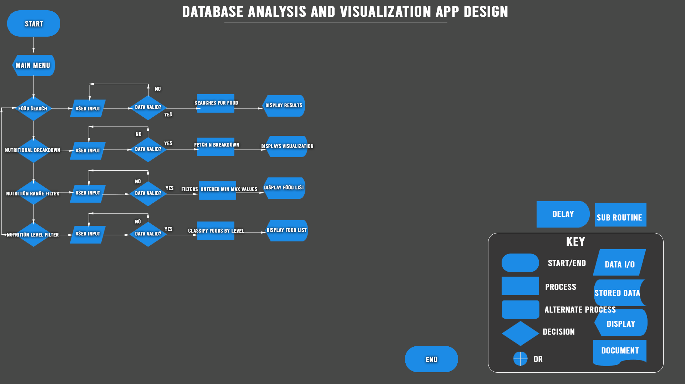
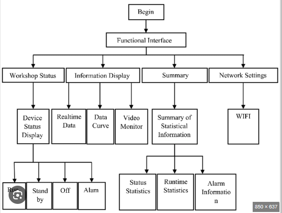

# Software Design Document

## Project Name: Nutrient Analyzer
## Group Number: 62

## Team members

| Student Number | Name          | 
|----------------|---------------|
| s5278432       | Simarjot Kaur |
| s5330485       | Stephen Koech | 
| s5376549       | Harsh Patel   | 

# Table of Contents

<!-- TOC -->
* [Table of Contents](#table-of-contents)
  * [1. System Vision](#1-system-vision)
    * [1.1 Problem Background](#11-problem-background)
    * [1.2 System capabilities/overview](#12-system-capabilitiesoverview)
    * [1.3	Potential Benefits](#13potential-benefits)
  * [2. Requirements](#2-requirements)
    * [2.1 User Requirements](#21-user-requirements)
    * [2.2	Software Requirements](#22software-requirements)
    * [2.3 Use Case Diagrams](#23-use-case-diagrams)
    * [2.4 Use Cases](#24-use-cases)
  * [3.	Software Design and System Components](#3-software-design-and-system-components-)
    * [3.1	Software Design](#31software-design)
    * [3.2	System Components](#32system-components)
      * [3.2.1 Functions](#321-functions)
      * [3.2.2 Data Structures / Data Sources](#322-data-structures--data-sources)
      * [3.2.3 Detailed Design](#323-detailed-design)
  * [4. User Interface Design](#4-user-interface-design)
    * [4.1 Structural Design](#41-structural-design)
    * [4.2	Visual Design](#42visual-design)
<!-- TOC -->

## 1. System Vision

### 1.1 Problem Background

- Problem Identification:

1. **System Benefits:**
This system is used for analyzing and visualizing nutritional data from various food items. It helps the users in the following ways:

1. **Food Search**: Enables consumers to obtain comprehensive nutritional data regarding certain meals swiftly.

2. **Visualizing Nutrient Breakdown**: Visual representations such as pie charts and bar graphs are provided to help people better comprehend the nutritional makeup of certain meals.

3. **Filtering by Nutrition Ranges**: This feature helps with diet planning and health management by allowing users to find items that fit within a given range of nutrients.

4. **Nutritional Level Categorization**: This feature makes it simpler for users to find foods that fall into particular dietary categories (low, mid, or high) by allowing them to filter items based on their levels of nutritional content.

Furthermore, the tool known as Nutrient Correlation Analysis provides a more in-depth understanding of the connections among distinct nutrients, assisting users in comprehending the possible links between different nutrients and their availability in different diets.

2.  **Dataset:**

The Nutritional_Food_Database.csv dataset, which includes comprehensive nutritional data for a variety of food products, is the one that was utilized. The following columns are part of the dataset:

- **Food:** The food item's name or kind.

- **Caloric Value:** The total energy contained in food, expressed as kilocalories (kcal) per 100 grams, is known as its calorie value.

- **Fat (in g):** Total fat content in grams, broken down into monounsaturated, polyunsaturated, and saturated fats.

- **carbs (in g):** Total carbs (including sugars) in 100 grams.

- **Protein:** The total amount of proteins in 100 grams.

- **Nutritional Fibre (g):** The amount of fiber in 100 grams.

- **Cholesterol (in mg):** The amount of cholesterol in milligrams, or mg/100 grammes.

- **Sodium (in g):** The amount of sodium in 100 grams.

- **Water (g):** The amount of water in 100 grammes.

- **Vitamins:** Different vitamins per 100 grammes (A, B1, B11, B12, B2, B3, B5, B6, C, D, E, and K in mg).

- **Minerals:** Different minerals per 100 grammes (Calcium, Copper, Iron, Magnesium, Manganese, Phosphorus, Potassium, Selenium, Zinc in mg).

- *Nutrition Density:** A measure of a food's nutritious content per calorie.

<![endif]>Data  Input/Output:  What  kind  of  data  input  and  output  is  required?

3. **Data Input:**

These are the data input types that the system needs:

**1. Food Name Enter:** Users may search for and obtain nutritional information about an item by entering its name.

**2. Input for Nutrient Selection:** Users may filter items according to their nutritional composition or choose certain nutrients (such as fat, protein, and carbs) to see how they are broken down.

**3. Input of Nutrient Range:** For a certain nutrient (fat between 5g and 10g, for example), users may enter the lowest and maximum values to filter meals that fall within that range.

**4. Choosing Nutrient Levels:** Foods may be filtered by the user according to the levels of fat, protein, carbs, and other nutrients (low, mid, and high).

**5. Input for Nutrient Correlation (for the extra feature):** Inn order to create scatter plots and determine correlation coefficients, users can choose two or more nutrients and examine their association.

4. **Data Output:**

The following categories of data output are offered by the system:

**1. Display of Nutritional Data:** The system provides all of the nutritional data, including calories, fats, carbs, proteins, vitamins, and minerals, for the food item that is being searched.

**2. Illustrations:** The system produces visuals that break down various nutrients (such as fat, protein, and carbs) for specific foods, such as pie charts and bar graphs.

**3. Food List Filtered:** meals that meet certain dietary criteria may be easily identified by the system, which provides a list of meals that match the user's selected nutritional range or level.

**4. Analysis of Nutrient Correlation (for the extra feature):** Scatter plots illustrating the link between certain nutrients produced by the system, together with trend lines and correlation coefficients that shed light on how these nutrients relate to one another in various diets.

- Target Users: Who will use the system, and why?

### 1.2 System capabilities/overview

- System Functionality: What will the system do?
- Features and Functionalities: Describe the key features and functionalities of the system.

### 1.3	Benefit Analysis

How will this system provide value or benefit?

## 2. Requirements

### 2.1 User Requirements

Detail how users are expected to interact with or use the program. What functionalities must the system provide from the end-user perspective? This can include both narrative descriptions and a listing of user needs.

Note: Since no specific client or user is assigned, you may create a fictional user. Who do you envision using your software?

### 2.2	Software Requirements
Define the functionality the software will provide. This section should list requirements formally, often using the word "shall" to describe functionalities.

Example Functional Requirements:  
- R1.1 The program shall accept multiple file names as arguments from the command line.  
- R1.2 Each file name can be a simple file name or include the full path of the file with one or more levels.  

- etc …

### 2.3 Use Case Diagram
Provide a system-level Use Case Diagram illustrating all required features.

Example:  

### 2.4 Use Cases
Include at least 5 use cases, each corresponding to a specific function.

| Use Case ID    | xxx  |
|----------------|------|
| Use Case Name  | xxxx |
| Actors         | xxxx |
| Description    | xxxx |
| Flow of Events | xxxx |
| Alternate Flow | xxxx |

# 3.	Software Design and System Components 

## 3.1	Software Design
In the Nutrient Analyzer System software's design, the below flowchart comprehensively and clearly outlines a sequential progression of the steps and operations in the software from start to end.

All Key Events Flowchart:  

# 3.2	System Components
The system components of the Nutrient Analyzer system covered in this section are:
* The programming functions used to return a desired and expected result from a user input when interacting with the system according to its design.
* The data structures used in this software during initialization to store properties of a function, addressing its type, where it has been used, and a list of functions that have used these data structures.
* A detailed design of the functions mentioned according to their usages, outlined in a flowchart to demonstrate how they work by making use of the data structures.

## 3.2.1 Functions
Below is a list and explanations of the key functions necessary to get the software functional in interacting with the database, the user and the functions to display the expected results.
In each function, there is:
- A description of the purpose of declaring the function,
- The input parameters taken by the function which should be of a specific data type to prevent errors, 
- The resulting value to be returned after the function has completed processing the input, and 
- Any side effects that the function may have to other elements in the software in any way.

## 1. Function 1 searching for a food by its name:
* ### <table><tr><td>   Function name: _search_food_by_its_name()_</td></tr></table>

1. Function's purpose:The above function takes in a value entered by a user and searches for a matching record against the food column in the database, then collects all the corresponding nutritional information of the entered food name.

2. Input parameters of the function: The function will take in the name of the food (food_name) of data type string, which will contain the name of the food to be searched. e.g ('peas canned') or ('cassava').

3. Returned value: After taking in the parameter into the function, the returned value will be of data type dictionary, which will contain all the values of the food nutritional information. food_dictionary = {"food":"cassava", "caloric value": "51"}

4. Side Effects:
No any side affects

## 2. Function 2 displays a visual representation of a selected food's nutritional breakdown:
* ### <table><tr><td> display_all_nutritional_breakdown() </td></tr></table>

1. Function's purpose: To take in the previously gathered nutritional information belonging to a specific food and returning a visual representation of its nutritional breakdown using a bar graph.

2. The function will take in the dictionary data type from the preceding function search_food_by_its_name(), of example food_dictionary = {"food":"cassava", "caloric value": "51"} process it by reading the dictionary properties and returning a visualized overview of the gathered values.

3. Return Value:
Returns a pie chart or a bar graph to give a visual representation of the nutritional properties of the specific food.

4. Side Effects:
No side effects.

## 3. Function 3 filters foods based on a selected nutrient value range (min-max)
* ### <table><tr><td> filter_foods_by_nutrient_range() </td></tr></table>

1. Function's purpose: To filter foods after a user makes a selection of a specific nutrient property of the food, and some value within a range.

2. The function will only take in values of data type string, which will be from a drop down which is a selection option list of values from the database, while also providing an input field on the interface with a string data type restriction to narrow down the options from the drop down selection list. The second input parameter will be of a pair of float, which will be the minimum and maximum values (minimum_value) and (maximum_value). For example the first input will be "protein" and the second pair of input float types would be "7.8" and "30".

3. The return value will be of a list data type that is now a filtered listing of only values that meet the above criteria.

4. Side Effects:
No side effects.

## 4. Function 4 Calculates nutritional level in a nutritional property (low, mid, high)
* ### <table><tr><td> calculate_nutrient_level() </td></tr></table>

1. Function's purpose: This function will take in all the numeric values from a specific column and using this key:
- low: less than 33% of the highest value,
- mid: between 33% and 66% of the highest value,
- high: greater than 66% of the highest value,

will then determine whether to classify an input to either being one and only one of the three options.

2. Input parameters: The function will take in a specific nutrient_name of type string, and all its numeric values in type float, to determine the highest value, then use it to classify whether the nutritional value of a specific food is either low, mid or high which will be returned in a tuple.

3. The function will return a tuple (low, mid, high) which each represents the threshold category a food falls within.

4. No side effects.

## 5. Function 5 filters foods by selected levels (low, mid, high)
* ### <table><tr><td> filter_foods_by_nutrient_level() </td></tr></table>

1. **Function's purpose** and **input parameters:** to filter foods by the levels of their nutritional values. The levels will be determined by the function outlined above calculate_nutrient_level() that calculates the level and returns a tuple of either being low, mid or high. This will work by taking in all the name of the food from the user, and the nutritional content level of type string (low, mid or high) which can be provided by a dropdown select option on the filter page.

2. Return value will be of type list, that will contain all foods fitting in the user selected parameters.

3. No side effects.

## 6. Function 6 nutritional density visualizer
* ### <table><tr><td> nutritional_density_visualizer() </td></tr></table>

1. Function's purpose: to take in food items from a user, check them in the database, calculate and display a visual representation of a food's nutritional density relative to the other selected foods.

2. The function will take in a dictionary type for the food items, and their nutrition density values from the nutrition density column in the database as a float. 

3. The returned result will be of a visual representation of the entered food name items, against each other's nutritional density score on a graph or pie chart,

4. No side effects.

## 3.2.2 Data Structures Used
The section below contains a list of all the data structures to be used in the software, that correspond to support the functions defined in section 3.2.1 of the document.
In each data structure, we outline the type, all its planned usages and  defined functions that use the data structure.

### <table><tr><td> 1. Data Structure: for (Food name and its nutritional information) </td></tr></table>

- Data structure type: List of dictionaries
- Usage: This list holds each food item and its corresponding nutritional information. 
- - Each dictionary type has been used to define a food item, with its properties from all other database columns such as "Saturated Fats,  Caloric Value, Fat, Sugars, Carbohydrates".

- All defined functions using the dictionary data type:
- - **search_food_by_name()**
- - **filter_foods_by_nutrient_range()**
- - **filter_foods_by_nutrient_level()**
- - **calculate_nutrient_level()**
- - **nutritional_density_visualizer()**

### <table><tr><td> 2. Data Structure: for (Food selected and its nutritional information) </td></tr></table>

- Data structure type: a dictionary
- Usage: When a user selects a specific food item, all the nutritional information is stored here.
- All functions using dictionary data type:
- - **display_all_nutritional_breakdown()**

### <table><tr><td> 3. Data Structure: for (storing already calculated nutrient threshold) </td></tr></table>

- Data structure type: Tuple
- Usage: It has been used to store the levels of a food nutrient level (which can either be low, mid or high)
- All functions using tuple data type:
- - **calculate_nutrient_level()**
- - **filter_foods_by_nutrient_level()**

### <table><tr><td> 4. Data Structure: for (storing already calculated min or max value of a calculated nutrient range) </td></tr></table>

- Data structure type: Tuple
- Usage: It has been used to store the levels of a food nutrient level (which can either be low, mid or high)
- Functions Using It:
- - filter_foods_by_nutrient_range()

# 3.2.3 Detailed Design
Below is a flowchart to expound more on the functional process of each function we have outlined above in 3.2.1

### 1. Function 1 Detailed design: _search_food_by_its_name()_

## 4. User Interface Design

### 4.1 Structural Design
Present a structural design, a hierarchy chart, showing the overall interface’s structure. Address:

- Structure: How will the software be structured?
- Information Grouping: How will information be organized?
- Navigation: How will users navigate through the software?
- Design Choices: Explain why these design choices were made.

Draft 1:  

### 4.2	Visual Design
Include all wireframes or mock-ups of the interface. Provide a discussion, explanation, and justification for your design choices. Hand-drawn wireframes are acceptable.

- Interface Components: Clearly label all components.
- Screens/Menus: Provide wireframes for different screens, menus, and options.
- Design Details: Focus on the layout and size of components; color and graphics are not required. 

Example:  

