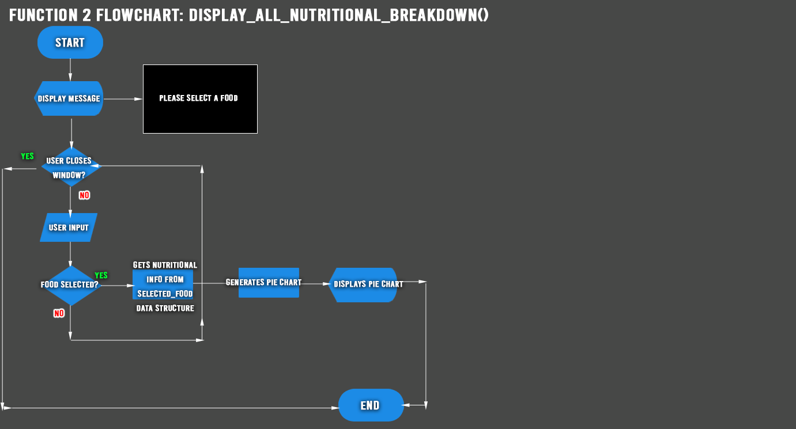
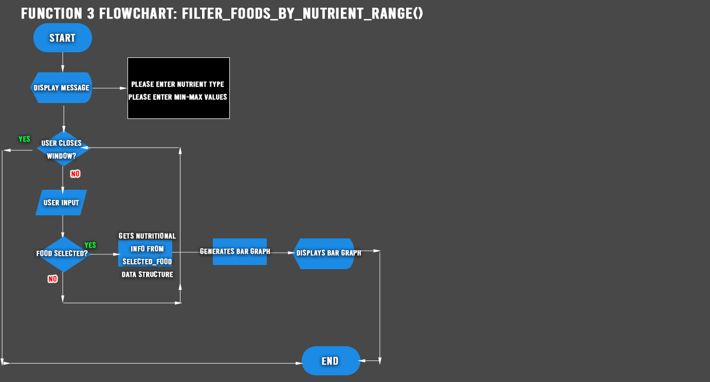
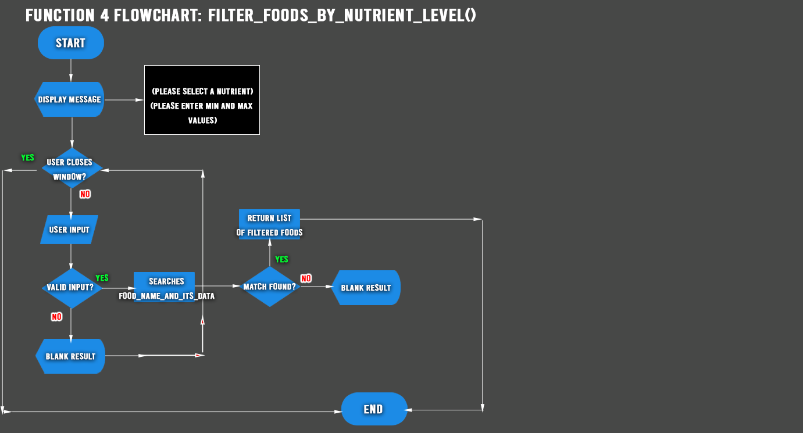

# Software Design Document

## Project Name: Nutrient Analyzer
## Group Number: 62

## Team members

| Student Number | Name          | 
|----------------|---------------|
| s5278432       | Simarjot Kaur |
| s5330485       | Stephen Koech | 
| s5376549       | Harsh Patel   | 

# Table of Contents

git<!-- TOC -->
* [Software Design Document](#software-design-document)
  * [Project Name: Nutrient Analyzer](#project-name-nutrient-analyzer)
  * [Group Number: 62](#group-number-62)
  * [Team members](#team-members)
* [Table of Contents](#table-of-contents)
  * [1. System Vision](#1-system-vision)
    * [1.1 Problem Background](#11-problem-background)
    * [1.2 System capabilities/overview](#12-system-capabilitiesoverview)
    * [1.3	Benefit Analysis](#13benefit-analysis)
  * [2. Requirements](#2-requirements)
    * [2.1 User Requirements](#21-user-requirements)
    * [2.2	Software Requirements](#22software-requirements)
    * [2.3 Use Case Diagram](#23-use-case-diagram)
    * [2.4 Use Cases](#24-use-cases)
* [3.	Software Design and System Components](#3-software-design-and-system-components-)
  * [3.1	Software Design](#31software-design)
* [3.2	System Components](#32system-components)
  * [3.2.1 Functions](#321-functions)
  * [1. Function 1 searching for a food by its name:](#1-function-1-searching-for-a-food-by-its-name)
  * [2. Function 2 displays a visual representation of a selected food's nutritional breakdown:](#2-function-2-displays-a-visual-representation-of-a-selected-foods-nutritional-breakdown)
  * [3. Function 3 filters foods based on a selected nutrient value range (min-max)](#3-function-3-filters-foods-based-on-a-selected-nutrient-value-range-min-max)
  * [4. Function 4 Calculates nutritional level in a nutritional property (low, mid, high)](#4-function-4-calculates-nutritional-level-in-a-nutritional-property-low-mid-high)
  * [5. Function 5 filters foods by selected levels (low, mid, high)](#5-function-5-filters-foods-by-selected-levels-low-mid-high)
  * [6. Function 6 nutritional density visualizer](#6-function-6-nutritional-density-visualizer)
  * [3.2.2 Data Structures Used](#322-data-structures-used)
    * [<table><tr><td> 1. Data Structure name (food_name_and_its_data): for (Food name and its nutritional information) </td></tr></table>](#tabletrtd-1-data-structure-name-foodnameanditsdata-for-food-name-and-its-nutritional-information-tdtrtable)
    * [<table><tr><td> 2. Data Structure name (selected_food) for: (Food selected and its nutritional information) </td></tr></table>](#tabletrtd-2-data-structure-name-selectedfood-for-food-selected-and-its-nutritional-information-tdtrtable)
    * [<table><tr><td> 3. Data Structure name (calculated_nutrient_levels) for: (storing already calculated nutrient threshold) </td></tr></table>](#tabletrtd-3-data-structure-name-calculatednutrientlevels-for-storing-already-calculated-nutrient-threshold-tdtrtable)
    * [<table><tr><td> 4. Data Structure name (calculated_nutrient_range) for: (storing already calculated min or max value of a calculated nutrient range) </td></tr></table>](#tabletrtd-4-data-structure-name-calculatednutrientrange-for-storing-already-calculated-min-or-max-value-of-a-calculated-nutrient-range-tdtrtable)
* [3.2.3 Detailed Design](#323-detailed-design)
    * [1. Function 1 Detailed design: _search_food_by_its_name()_](#1-function-1-detailed-design-searchfoodbyitsname)
    * [2. Function 2 Detailed design: _display_all_nutritional_breakdown()_](#2-function-2-detailed-design-displayallnutritionalbreakdown)
    * [3. Function 3 Detailed design: _filter_foods_by_nutrient_range()_](#3-function-3-detailed-design-filterfoodsbynutrientrange)
    * [4. Function 4 Detailed design: _calculate_nutrient_level()_](#4-function-4-detailed-design-calculatenutrientlevel)
    * [5. Function 5 Detailed design: _filter_foods_by_nutrient_level()_](#5-function-5-detailed-design-filterfoodsbynutrientlevel)
    * [6. Function 6 Detailed design: _nutritional_density_visualizer()_](#6-function-6-detailed-design-nutritionaldensityvisualizer)
  * [4. User Interface Design](#4-user-interface-design)
    * [4.1 Structural Design](#41-structural-design)
    * [Planned structure of the application frames in wxForm builder:](#planned-structure-of-the-application-frames-in-wxform-builder)
    * [4.1.2 Information Grouping](#412-information-grouping)
    * [4.1.3 Navigation](#413-navigation)
      * [4.1.3.1 Navigation Logic](#4131-navigation-logic)
    * [4.2	Visual Design](#42visual-design)
    * [Nutrient Analyzer Wireframes](#nutrient-analyzer-wireframes)
    * [1. Main Home Screen](#1-main-home-screen)
      * [Components of Home Screen:](#components-of-home-screen)
    * [Justification of the Home screen design:](#justification-of-the-home-screen-design)
    * [2. Food Search Screen](#2-food-search-screen)
      * [Components of the Food Search Screen:](#components-of-the-food-search-screen)
    * [Justification of Food Search Screen design](#justification-of-food-search-screen-design)
    * [3. Nutritional Breakdown Screen](#3-nutritional-breakdown-screen)
      * [Components of the Nutritional Breakdown Screen:](#components-of-the-nutritional-breakdown-screen)
    * [Justification of Nutritional Breakdown Screen design](#justification-of-nutritional-breakdown-screen-design)
    * [4. Nutrition Range Filter Screen](#4-nutrition-range-filter-screen)
      * [Components of the Nutrition Range Filter Screen:](#components-of-the-nutrition-range-filter-screen)
    * [Justification of Nutrition Range Filter design](#justification-of-nutrition-range-filter-design)
    * [5. Nutrition Level Filter Screen](#5-nutrition-level-filter-screen)
      * [Components of the Nutrition Level Filter Screen:](#components-of-the-nutrition-level-filter-screen)
    * [Justification of Nutrition Level Filter design](#justification-of-nutrition-level-filter-design)
    * [5. Nutrition Density Visualizer Screen](#5-nutrition-density-visualizer-screen)
      * [Components of the Nutrition Density Visualizer Screen:](#components-of-the-nutrition-density-visualizer-screen)
    * [Justification of Density Visualizer Screen design](#justification-of-density-visualizer-screen-design)
    * [Overall screen navigation and design logic](#overall-screen-navigation-and-design-logic)
<!-- TOC -->

## 1. System Vision

### 1.1 Problem Background

- Problem Identification:

1. **System Benefits:**
This system is used for analyzing and visualizing nutritional data from various food items. It helps the users in the following ways:

1. **Food Search**: Enables consumers to obtain comprehensive nutritional data regarding certain meals swiftly.

2. **Visualizing Nutrient Breakdown**: Visual representations such as pie charts and bar graphs are provided to help people better comprehend the nutritional makeup of certain meals.

3. **Filtering by Nutrition Ranges**: This feature helps with diet planning and health management by allowing users to find items that fit within a given range of nutrients.

4. **Nutritional Level Categorization**: This feature makes it simpler for users to find foods that fall into particular dietary categories (low, mid, or high) by allowing them to filter items based on their levels of nutritional content.

Furthermore, the tool known as Nutrient Correlation Analysis provides a more in-depth understanding of the connections among distinct nutrients, assisting users in comprehending the possible links between different nutrients and their availability in different diets.

2.  **Dataset:**

The Nutritional_Food_Database.csv dataset, which includes comprehensive nutritional data for a variety of food products, is the one that was utilized. The following columns are part of the dataset:

- **Food:** The food item's name or kind.

- **Caloric Value:** The total energy contained in food, expressed as kilocalories (kcal) per 100 grams, is known as its calorie value.

- **Fat (in g):** Total fat content in grams, broken down into monounsaturated, polyunsaturated, and saturated fats.

- **carbs (in g):** Total carbs (including sugars) in 100 grams.

- **Protein:** The total amount of proteins in 100 grams.

- **Nutritional Fibre (g):** The amount of fiber in 100 grams.

- **Cholesterol (in mg):** The amount of cholesterol in milligrams, or mg/100 grammes.

- **Sodium (in g):** The amount of sodium in 100 grams.

- **Water (g):** The amount of water in 100 grammes.

- **Vitamins:** Different vitamins per 100 grammes (A, B1, B11, B12, B2, B3, B5, B6, C, D, E, and K in mg).

- **Minerals:** Different minerals per 100 grammes (Calcium, Copper, Iron, Magnesium, Manganese, Phosphorus, Potassium, Selenium, Zinc in mg).

- *Nutrition Density:** A measure of a food's nutritious content per calorie.

<![endif]>Data  Input/Output:  What  kind  of  data  input  and  output  is  required?

3. **Data Input:**

These are the data input types that the system needs:

**1. Food Name Enter:** Users may search for and obtain nutritional information about an item by entering its name.

**2. Input for Nutrient Selection:** Users may filter items according to their nutritional composition or choose certain nutrients (such as fat, protein, and carbs) to see how they are broken down.

**3. Input of Nutrient Range:** For a certain nutrient (fat between 5g and 10g, for example), users may enter the lowest and maximum values to filter meals that fall within that range.

**4. Choosing Nutrient Levels:** Foods may be filtered by the user according to the levels of fat, protein, carbs, and other nutrients (low, mid, and high).

**5. Input for Nutrient Correlation (for the extra feature):** Inn order to create scatter plots and determine correlation coefficients, users can choose two or more nutrients and examine their association.

4. **Data Output:**

The following categories of data output are offered by the system:

**1. Display of Nutritional Data:** The system provides all of the nutritional data, including calories, fats, carbs, proteins, vitamins, and minerals, for the food item that is being searched.

**2. Illustrations:** The system produces visuals that break down various nutrients (such as fat, protein, and carbs) for specific foods, such as pie charts and bar graphs.

**3. Food List Filtered:** meals that meet certain dietary criteria may be easily identified by the system, which provides a list of meals that match the user's selected nutritional range or level.

**4. Analysis of Nutrient Correlation (for the extra feature):** Scatter plots illustrating the link between certain nutrients produced by the system, together with trend lines and correlation coefficients that shed light on how these nutrients relate to one another in various diets.

- Target Users: Who will use the system, and why?

### 1.2 System capabilities/overview

- System Functionality: What will the system do?
- Features and Functionalities: Describe the key features and functionalities of the system.

### 1.3	Benefit Analysis

How will this system provide value or benefit?

## 2. Requirements

### 2.1 User Requirements

Detail how users are expected to interact with or use the program. What functionalities must the system provide from the end-user perspective? This can include both narrative descriptions and a listing of user needs.

Note: Since no specific client or user is assigned, you may create a fictional user. Who do you envision using your software?

### 2.2	Software Requirements
Define the functionality the software will provide. This section should list requirements formally, often using the word "shall" to describe functionalities.

Example Functional Requirements:  
- R1.1 The program shall accept multiple file names as arguments from the command line.  
- R1.2 Each file name can be a simple file name or include the full path of the file with one or more levels.  

- etc …

### 2.3 Use Case Diagram
Provide a system-level Use Case Diagram illustrating all required features.

Example:  

### 2.4 Use Cases
Include at least 5 use cases, each corresponding to a specific function.

| Use Case ID    | xxx  |
|----------------|------|
| Use Case Name  | xxxx |
| Actors         | xxxx |
| Description    | xxxx |
| Flow of Events | xxxx |
| Alternate Flow | xxxx |

# 3.	Software Design and System Components 

## 3.1	Software Design
In the Nutrient Analyzer System software's design, the below flowchart comprehensively and clearly outlines a sequential progression of the steps and operations in the software from start to end.

All Key Events Flowchart:  

# 3.2	System Components
The system components of the Nutrient Analyzer system covered in this section are:
* The programming functions used to return a desired and expected result from a user input when interacting with the system according to its design.
* The data structures used in this software during initialization to store properties of a function, addressing its type, where it has been used, and a list of functions that have used these data structures.
* A detailed design of the functions mentioned according to their usages, outlined in a flowchart to demonstrate how they work by making use of the data structures.

## 3.2.1 Functions
Below is a list and explanations of the key functions necessary to get the software functional in interacting with the database, the user and the functions to display the expected results.
In each function, there is:
- A description of the purpose of declaring the function,
- The input parameters taken by the function which should be of a specific data type to prevent errors, 
- The resulting value to be returned after the function has completed processing the input, and 
- Any side effects that the function may have to other elements in the software in any way.

## 1. Function 1 searching for a food by its name:
* ### <table><tr><td>   Function name: _search_food_by_its_name()_</td></tr></table>

1. Function's purpose:The above function takes in a value entered by a user and searches for a matching record against the food column in the database, then collects all the corresponding nutritional information of the entered food name.

2. Input parameters of the function: The function will take in the name of the food (food_name) of data type string, which will contain the name of the food to be searched. e.g ('peas canned') or ('cassava').

3. Returned value: After taking in the parameter into the function, the returned value will be of data type dictionary, which will contain all the values of the food nutritional information. food_dictionary = {"food":"cassava", "caloric value": "51"}

4. Side Effects:
No any side affects

## 2. Function 2 displays a visual representation of a selected food's nutritional breakdown:
* ### <table><tr><td> display_all_nutritional_breakdown() </td></tr></table>

1. Function's purpose: To take in the previously gathered nutritional information belonging to a specific food and returning a visual representation of its nutritional breakdown using a bar graph.

2. The function will take in the dictionary data type from the preceding function search_food_by_its_name(), of example food_dictionary = {"food":"cassava", "caloric value": "51"} process it by reading the dictionary properties and returning a visualized overview of the gathered values.

3. Return Value:
Returns a pie chart or a bar graph to give a visual representation of the nutritional properties of the specific food.

4. Side Effects:
No side effects.

## 3. Function 3 filters foods based on a selected nutrient value range (min-max)
* ### <table><tr><td> filter_foods_by_nutrient_range() </td></tr></table>

1. Function's purpose: To filter foods after a user makes a selection of a specific nutrient property of the food, and some value within a range.

2. The function will only take in values of data type string, which will be from a drop down which is a selection option list of values from the database, while also providing an input field on the interface with a string data type restriction to narrow down the options from the drop down selection list. The second input parameter will be of a pair of float, which will be the minimum and maximum values (minimum_value) and (maximum_value). For example the first input will be "protein" and the second pair of input float types would be "7.8" and "30".

3. The return value will be of a list data type that is now a filtered listing of only values that meet the above criteria.

4. Side Effects:
No side effects.

## 4. Function 4 Calculates nutritional level in a nutritional property (low, mid, high)
* ### <table><tr><td> calculate_nutrient_level() </td></tr></table>

1. Function's purpose: This function will take in all the numeric values from a specific column and using this key:
- low: less than 33% of the highest value,
- mid: between 33% and 66% of the highest value,
- high: greater than 66% of the highest value,

will then determine whether to classify an input to either being one and only one of the three options.

2. Input parameters: The function will take in a specific nutrient_name of type string, and all its numeric values in type float, to determine the highest value, then use it to classify whether the nutritional value of a specific food is either low, mid or high which will be returned in a tuple.

3. The function will return a tuple (low, mid, high) which each represents the threshold category a food falls within.

4. No side effects.

## 5. Function 5 filters foods by selected levels (low, mid, high)
* ### <table><tr><td> filter_foods_by_nutrient_level() </td></tr></table>

1. **Function's purpose** and **input parameters:** to filter foods by the levels of their nutritional values. The levels will be determined by the function outlined above calculate_nutrient_level() that calculates the level and returns a tuple of either being low, mid or high. This will work by taking in all the name of the food from the user, and the nutritional content level of type string (low, mid or high) which can be provided by a dropdown select option on the filter page.

2. Return value will be of type list, that will contain all foods fitting in the user selected parameters.

3. No side effects.

## 6. Function 6 nutritional density visualizer
* ### <table><tr><td> nutritional_density_visualizer() </td></tr></table>

1. Function's purpose: to take in food items from a user, check them in the database, calculate and display a visual representation of a food's nutritional density relative to the other selected foods.

2. The function will take in a dictionary type for the food items, and their nutrition density values from the nutrition density column in the database as a float. 

3. The returned result will be of a visual representation of the entered food name items, against each other's nutritional density score on a graph or pie chart,

4. No side effects.

## 3.2.2 Data Structures Used
The section below contains a list of all the data structures to be used in the software, that correspond to support the functions defined in section 3.2.1 of the document.
In each data structure, we outline the type, all its planned usages and  defined functions that use the data structure.

### <table><tr><td> 1. Data Structure name (food_name_and_its_data): for (Food name and its nutritional information) </td></tr></table>

- Data structure type: List of dictionaries
- Usage: This list holds each food item and its corresponding nutritional information. 
- - Each dictionary type has been used to define a food item, with its properties from all other database columns such as "Saturated Fats,  Caloric Value, Fat, Sugars, Carbohydrates".

- All defined functions using the dictionary data type:
- - **search_food_by_name()**
- - **filter_foods_by_nutrient_range()**
- - **filter_foods_by_nutrient_level()**
- - **calculate_nutrient_level()**
- - **nutritional_density_visualizer()**

### <table><tr><td> 2. Data Structure name (selected_food) for: (Food selected and its nutritional information) </td></tr></table>

- Data structure type: a dictionary
- Usage: When a user selects a specific food item, all the nutritional information is stored here.
- All functions using dictionary data type:
- - **display_all_nutritional_breakdown()**

### <table><tr><td> 3. Data Structure name (calculated_nutrient_levels) for: (storing already calculated nutrient threshold) </td></tr></table>

- Data structure type: Tuple
- Usage: It has been used to store the levels of a food nutrient level (which can either be low, mid or high)
- All functions using tuple data type:
- - **calculate_nutrient_level()**
- - **filter_foods_by_nutrient_level()**

### <table><tr><td> 4. Data Structure name (calculated_nutrient_range) for: (storing already calculated min or max value of a calculated nutrient range) </td></tr></table>

- Data structure type: Tuple
- Usage: It has been used to store the levels of a food nutrient level (which can either be low, mid or high)
- Functions Using It:
- - filter_foods_by_nutrient_range()

# 3.2.3 Detailed Design
Below is a flowchart to expound more on the functional process of each function we have outlined above in 3.2.1

### 1. Function 1 Detailed design: _search_food_by_its_name()_

In the search_food_by_its_name() function, it begins by displaying a message to a user to enter a food item they would like to search. In the event that a user does not close the window and enters an input, it is checked if it matches the data type and a feedback is given if a user inputs an invalid data type. If the input is valid, the input is checked against the stored data structure 'food_name_and_its_data' that contains a list of dictionaries. If a match is found, the function returns the data.

### 2. Function 2 Detailed design: _display_all_nutritional_breakdown()_

The function to display_all_nutritional_breakdown() would make use of the data structure food_name_and_its_data containing a list of dictionaries by finding the selected food result inside it and using it to generate a visual bar graph to show in the display panel.

### 3. Function 3 Detailed design: _filter_foods_by_nutrient_range()_

The function filter_foods_by_nutrient_range() uses the data structure food_name_and_its_data containing the list of dictionaries, to find a valid nutrient range property input by a user, and returns a list of only food items fitting the specified parameters.

### 4. Function 4 Detailed design: _calculate_nutrient_level()_

After getting its value from food_name_and_its_data data structure, This function is later used in the function filter_foods_by_nutrient_level
() after taking all the values from a nutrient column to either classify as low, medium or high and store in the data structure calculated_nutrient_levels and filter_foods_by_nutrient_level.

### 5. Function 5 Detailed design: _filter_foods_by_nutrient_level()_

After getting the levels category of a nutrient from the function calculate_nutrient_level(), and data structure food_name_and_its_data() this function then takes the user selection of a nutrient, level selected and returns food items falling in within either of the 3 levels. then storing the values in the data structure filter_foods_by_nutrient_level.

### 6. Function 6 Detailed design: _nutritional_density_visualizer()_

The function nutritional_density_visualizer() takes in multiple selected inputs of food items from a user, filters the food items from the food_name_and_its_data data structure to get the comparison in its nutritional density then processes it to return a display of the visual comparison of the entered values.

## 4. User Interface Design

### 4.1 Structural Design
Present a structural design, a hierarchy chart, showing the overall interface’s structure. Address:

- Structure: How will the software be structured?
- Information Grouping: How will information be organized?
- Navigation: How will users navigate through the software?
- Design Choices: Explain why these design choices were made.
- ### 4.1.1 Structure
Using wxForm Builder for our user interface design, we will utilize the event driven approach while having our backend functions run by python. 
For further simplicity, each feature in the software will be carried out in their own frames designed in wxForm builder.

### Planned structure of the application frames in wxForm builder:
1. Main home screen: will serve as the main welcome page that contains the main menu to access any other windows. A short information will be included in the home screen to serve as an education purpose for users new to the software.
2. Food search screen
This screen will contain a search bar to take user input of a food item and display its nutritional details
3. Nutritional breakdown screen
This screen will contain a drop down for a user to select a food items and a display area for pie charts and bra graph.
4. Nutritional range filter screen
This screen will contain a dropdown to select a nutrient, take a pair of minimum and maximum values and a display area field to show the filtered food item results
5. Nutrition level filter screen
THis screen structure will contain a dropdown to select nutrients, buttons to select either low, medium or high nutrient levels, and a display area to show resulting food items
6. Nutrition density visualizer screen 
This screen takes in multiple food items from a user, then returns a visual representation of a comparison between the nutritional densities in the display area field.

### 4.1.2 Information Grouping
To ensure that we maintain a user friendly interface that is free from clutter, we will need to group our components inside wxForm builder. 
We can utilise this feature to group our elements by specific windows.

For instance, in our main home page screen, when making our main menu, we will group our buttons:
- food search button, nutritional breakdown, nutrition range filter, nutrition level filter, analysis and visualization
1. In our window 'food search'
we will group the elements such that the search bar, the 'submit' button and results display area will be contained in the same window.
2. In the nutritional breakdown window, we group the dropdown menu section and the visual element display area which will contain either a pie chart or a bar graph.
3. Nutrition range filter screen
Being the page that takes in a set of input from a user, we group the nutrient dropdown, the pair of input fields, the submit button to filter and the display panel that shows the results of the filtered values.
4. Nutrition level filter screen
On the nutrition level filter screen, we group the elements drop down that selects a specific nutrient, one of three nutrition level low, medium or high, the submit button and results display area.
5. For the additional function, the nutritional density visualizer will take in a maximum of five drop down properties as input from a user, and we will group that with its submit button and the display area that shows a bar graph of the data comparison.

### 4.1.3 Navigation
In our navigation design, we implemented consistency in visual and structural design, such that a common menu will be pinned at the top of the frame and provides access to all functional windows in the software. Besides that, each window visited will have a back button, so that if a user is not able to recall which page they were previously on, simply clicking on the back button would return them to their previous page.
 

#### 4.1.3.1 Navigation Logic
1. The main home screen user interface will provide a possibility to navigate to any other page by clicking of buttons on the top of the screen. This navigation template is reused in all other pages since it does not collide with the functional pages content, and enhances consistency for a users familiarization of the interface. This transition logic where users do not necessarily have to revisit the home page again to navigate to other modules is helpful to maintain ease of screen navigation.

- ### 4.1.4 Design Choices
1. wxForm Builder:
Due to its design simplicity of creating a user interface through the use of a visual user interface, wxForm builder is our go to option since it consequently makes it easier to connect our events from the interface to python backend functions.
In the event that we need to make changes to our design, we simply make the update in wxForm builder then paste the new generated template code to link to our python backend functions.
2. Centralised navigation from all pages.
Providing a pinned common menu accessible from all pages ensures users always have an easy way to switch between pages without necessarily having to go to the main home page once again.
3. Splitting different features into different frames. This contributes to the overall orderliness in the software, providing that users will now only view what is relevant to their current function or what they want to achieve.
4. Usage of graphs and charts for graphical data visualization.
Other than the raw information being accessible to users, presenting a visual version of the data allows users to experience a better way of interpreting data that could otherwise be difficult to tell apart significant differences.

### 4.2	Visual Design
### Nutrient Analyzer Wireframes
### 1. Main Home Screen
This will be the main starting point of the software, where access points to any other location within the program will start from.

#### Components of Home Screen:
- The Title: Nutrient Analyzer
- Menu comprising of:
- - Home
- - Food Search 
- - Nutrition Breakdown 
- - Nutrition Range Filter 
- - Nutrition Level Filter 
- - Nutritional Density Visualizer
- - Close

- #### Welcome message and a brief introduction

### Justification of the Home screen design:
- This design is meant to provide a familiar interface that is similar to other already existing applications, leading to an intuitive experience where a user can easily point out the location of a feature they are after. Including a grouped menu also simplifies navigation since all the main functions of Nutrient Analyzer are included here.
- The menu on the top of the home page will be consistent throughout the user interaction with the software, for a simplified and straight forward user navigation.

### 2. Food Search Screen
This being the first function of the software, allows a user to enter a food item which will then output all its nutritional information.

#### Components of the Food Search Screen:
- Menu
- Search bar
- - This provides the input field for a user to enter a desired food item of string data type.
- Search button
- - After typing a desired food item entry, the submit button will send a request to search from the food column of the database and list its relative data.
- Results/Message display.
- - This display field will show the results of the user search value in form of a list, or if the user entered an invalid input it would display in this dynamic field.
- -Since the record from the database is large, we want to support a scroll functionality to view more overflowing results.
- Back button to return to the page they were in previously.

### Justification of Food Search Screen design
Ensuring we have enough space to comfortably view the results, the scroll bar enables more data to load in the view. By fixing the search panel on a different section, we ensure a clean interface design that separated the user input section and results section.

### 3. Nutritional Breakdown Screen
This screen will display a visual pie charts and bar graphs to show the nutrients of a food item selected by a user.

#### Components of the Nutritional Breakdown Screen:
- Menu
- Dropdown to select one food item
- Instructional text label to "Select a food item"
- Graphs and Charts Display area at center of the screen.
- Checkbox to change visual layout between a pie chart and a graph.
- Back button to take user to previous page.

### Justification of Nutritional Breakdown Screen design
- The importance of having a visual representation of the nutritional breakdown structure is to present a visually appealing translation of data for better perception of users. Adding a function to switch between either styling of chart presentation would be accommodating for different audience needs.
- Including a dropdown instead of users having to type in the names of the food item makes it easier to access records from the database compared to having a normal manual search.

### 4. Nutrition Range Filter Screen
- This screen allows users to select a nutrient from a dropdown, then a minimum and maximum input of a value pair to display any results falling within the parameters. 

#### Components of the Nutrition Range Filter Screen:
- Menu
- Nutrient dropdown selection
- - An instructional label telling a user to enter a (minimum and maximum value)
- Inputs
- - input for minimum
- - input for maximum
- Apply filter button
- Filtered results display area
- Scroll bar for large data results beyond the first page view

### Justification of Nutrition Range Filter design
- Providing a separated section for user input only and for data display provides a cleaner and an orderly interface.
- Providing a user with an option to filer results especially if the data being dealt with is of large amounts can be overwhelming simplifies the approach and user interaction on the software.

### 5. Nutrition Level Filter Screen
The nutrition level filter screen corresponds to the function of allowing a user to view filtered food items based on the level of their nutrient content level which can either be low, medium or high

#### Components of the Nutrition Level Filter Screen:
- Dropdown to select a specific nutrient type
- - Informative label placeholder to ask a user to select a nutrient type
- - Informative label to ask a user to select the nutrition level they want
- Nutrient level selection option (Radio buttons will be used because of their property of selecting only one value in a group)
- Button to apply filter
- Filtered results display section in the screen
- scroll bar in the display section
- back button to the user's previous screen

### Justification of Nutrition Level Filter design
When it comes to making a selection to apply a filter, we want to make it as easy as possible for the user. Hence the use of radio buttons in the nutrition level group which only takes one option. This way a user knows they are supposed to only pick one option.

### 5. Nutrition Density Visualizer Screen
This will be the last option on the pinned menu on the user interface, and once on this page, a user can enter several food items to compare their nutritional density, getting a visual representation of the comparison.
For ease of use of this analysis feature, we limit the food selection options to 5 food items.

#### Components of the Nutrition Density Visualizer Screen:
- A maximum of 5 food item selection list
- - An informative label to ask a user to select up to 5 food items from the drop-down options.
- - Compare button
- Display panel to show a bar graph that compares the nutritional density levels of the selected food items.
- Back button to return a user to their previous page.

### Justification of Density Visualizer Screen design
- With this additional feature, we need to compare and get a better representation of the nutritional density of several food items, hence the need to take in multiple selection options of the food items.
- With this implementation, we restrict a user from selecting the same food item more than once as this will have no comparison value as a duplicate.  

### Overall screen navigation and design logic
- The consistency employed in the design of all the screens is so that it can give users a familiarized user interface, and the pinned menu at the top ensures a user can freely navigate to a screen of their choice if they do not wish to return to the previous screen.